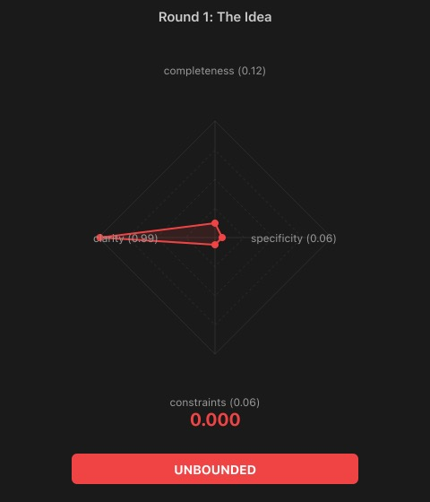
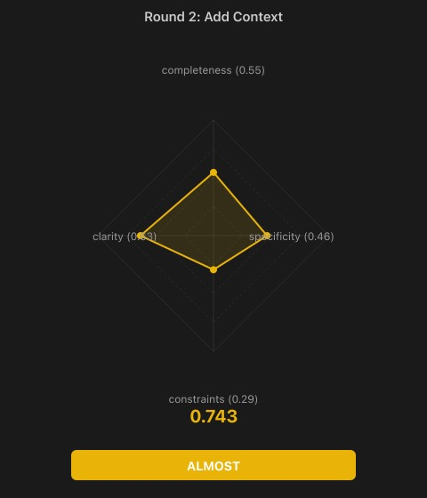
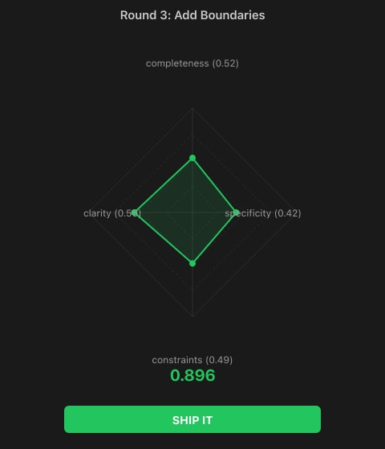
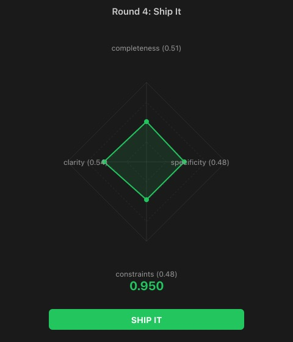

# Spec Score MCP

[](https://www.npmjs.com/package/spec-score-mcp)
[](https://smithery.ai/server/openpoem/spec-score-mcp)
[](https://chatgpt.com/g/g-69a2c0c5693c8191b439da913df10834-spec-score-mcp)
[](https://registry.modelcontextprotocol.io)

Score your specs before Claude builds from them.

**A balanced spec produces balanced code. An unbalanced spec produces creative fiction.**

## The problem

When your spec is detailed on some axes but vague on others, Claude doesn't ask for clarification — it fills in the blanks. The result compiles, the tests pass, but it's not what you meant.

This tool catches that before you start building. It scores your spec on 4 axes, tells you which one is weakest, and gives you a concrete tip to fix it.

## 4 axes

| Axis | Question it answers |
|---|---|
| **completeness** | Can Claude understand the full scope of what to build? |
| **clarity** | Is there only one way to interpret this spec? |
| **constraints** | Does Claude know what NOT to build? |
| **specificity** | Are there concrete, testable details? |

Each axis scores 0.0 to 1.0. The **balance score** measures how evenly the 4 axes are covered.

**Balance matters more than individual scores.** A spec scoring 0.50 on all 4 axes (balance: 0.97) will produce better output than one scoring 0.95 / 0.95 / 0.20 / 0.90 (balance: 0.58). Why? That one weak axis — constraints at 0.20 — is exactly where Claude will improvise. You described what to build in detail, but forgot to say what's out of scope. So Claude builds everything you asked for, plus features you didn't.

On the radar chart: an even diamond beats a sharp spike.

## Verdicts

| Verdict | What it means |
|---|---|
| **SHIP IT** | Spec is ready — Claude knows what to build and what not to |
| **ALMOST** | One axis needs a small fix before you start |
| **DRAFT** | Multiple axes need work, but the structure is there |
| **VAGUE** | Well-organized but too abstract to act on |
| **UNBOUNDED** | Clear goal but no boundaries — Claude will over-build |
| **OVER-CONSTRAINED** | Lots of rules but unclear what the actual goal is |
| **SKETCH** | Starting point — needs detail on most axes |

Not SHIP IT yet? The tool tells you which axis is weakest and what to add. Fix that axis, re-score, repeat. Most specs reach SHIP IT in 2-3 rounds.

## Install

```bash
npm i -g spec-score-mcp
claude mcp add spec-score -- npx spec-score-mcp
```

That's it. The 3 tools are now available in every Claude Code session.

## Usage

### Slash commands

Clone this repo to get the built-in slash commands:

```
/project:scan my-feature-spec.md
```

Reads the file, scores it, and writes a `my-feature-spec.md.scored.md` with scores, verdict, tip, and a radar chart.

```
/project:compare blueprint.md implementation.md
```

Scores both files and writes a `compared.scored.md` with side-by-side radar charts.

### Direct tool use

The 3 MCP tools work in any Claude Code conversation:

| Tool | What it does |
|---|---|
| `spec_score` | Scores a spec on 4 axes, returns balance score and verdict |
| `spec_visualize` | Generates an SVG radar chart from scores |
| `spec_compare` | Side-by-side comparison of two scored specs |

Ask Claude: *"Score this spec"*, *"Show me the radar chart"*, or *"Compare these two specs"*.

## Example: from UNBOUNDED to SHIP IT

This tool scoring its own spec — four rounds, each fixing the weakest axis:

<p align="center">
  
</p>

### Round 1: the idea

> Build a spec scoring tool



```
UNBOUNDED  0.12  Tip: What does 'scoring' mean? What axes? What output?
```

One axis is high (clarity — the goal is clear), everything else is near zero. Claude would build... anything. A web app? A CLI? A VS Code extension? No way to know.

### Round 2: add context

> Build an MCP server that scores specs on 4 axes: completeness, clarity,
> constraints, specificity. Each axis is 0.0-1.0. Returns a balance score and verdict.



```
ALMOST  0.67  Tip: What are the verdicts? What does the tool NOT do?
```

Now Claude knows what to build. But constraints are still weak — it might add auto-fixing, CI integration, a database.

### Round 3: add boundaries

> Three tools: spec_score, spec_visualize, spec_compare.
> Non-goals: no auto-fixing, no CI integration, no storage.



```
SHIP IT  0.84  Tip: Add testable criteria — what balance maps to which verdict?
```

Crossed the threshold. Claude now knows what to build AND what not to build. Specificity is still the weakest axis.

### Round 4: add testable details

> Balance = 1 - sqrt(variance)/mean. SHIP IT > 0.75, ALMOST > 0.60,
> plus pattern-based verdicts. Node.js, MCP SDK, stdio transport.



```
SHIP IT  0.95  Spec is ready for implementation.
```

Four rounds: 0.12 → 0.67 → 0.84 → 0.95. Each round fixed exactly one thing.

## The math

1. Claude scores each axis (0.0 - 1.0)
2. Normalize the vector: `v / ||v||`
3. Balance: `1 - sqrt(variance) / mean`
4. Verdict: balance threshold + axis pattern matching

The scoring intelligence comes from Claude, not from the algorithm. The algorithm only measures balance.

## Also available as

| Platform | Link |
|---|---|
| **npm** | [`npx spec-score-mcp`](https://www.npmjs.com/package/spec-score-mcp) |
| **MCP Registry** | [`io.github.openpoem/spec-score-mcp`](https://registry.modelcontextprotocol.io) |
| **ChatGPT** | [Custom GPT in ChatGPT Store](https://chatgpt.com/g/g-69a2c0c5693c8191b439da913df10834-spec-score-mcp) |
| **Smithery** | [MCP server directory](https://smithery.ai/server/openpoem/spec-score-mcp) |
| **Glama** | [MCP server directory](https://glama.ai/mcp/servers/spec-score-mcp) |
| **HTTP API** | [spec-score-mcp.vercel.app](https://spec-score-mcp.vercel.app) |

The HTTP API powers the Custom GPT and can be used standalone:

| Endpoint | What it does |
|---|---|
| `POST /api/score` | Score a spec → JSON with balance, verdict, axes |
| `POST /api/visualize` | Score a spec → SVG radar chart |
| `POST /api/compare` | Compare two specs → side-by-side SVG |

## Project structure

```
src/
  mcp.ts        # MCP server (3 tools)
  score.ts      # Scoring engine
  visualize.ts  # SVG radar charts
api/
  score.ts      # HTTP API — JSON scoring
  visualize.ts  # HTTP API — SVG radar chart
  compare.ts    # HTTP API — side-by-side comparison
  index.ts      # Landing page
  privacy.ts    # Privacy policy
  openapi.json  # OpenAPI spec (used by ChatGPT Actions)
.claude/
  commands/
    scan.md     # /project:scan command
    compare.md  # /project:compare command
```

---

**OpenPoem** — spec-score-mcp

MIT License.

© 2026 OpenPoem. info@openpoem.org
